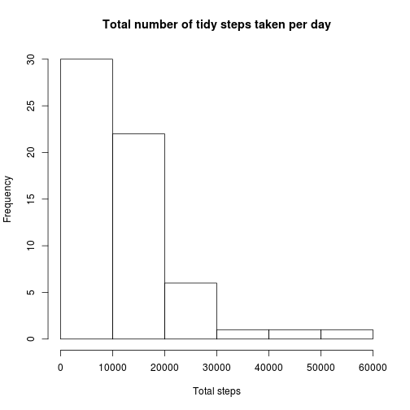

# About this document

It is now possible to collect a large amount of data about personal movement using activity monitoring devices such as a Fitbit, Nike Fuelband, or Jawbone Up. These type of devices are part of the "quantified self" movement -- a group of enthusiasts who take measurements about themselves regularly to improve their health, to find patterns in their behavior, or because they are tech geeks. But these data remain under-utilized both because the raw data are hard to obtain and there is a lack of statistical methods and software for processing and interpreting the data.

In this document we show in a reproducible way the research done on a set of data from a personal activity monitoring device. This device collects data at 5 minute intervals through out the day. The data consists of two months of data from an anonymous individual collected during the months of October and November, 2012 and include the number of steps taken in 5 minute intervals each day.

## Loading and preprocessing the data

The activity data can be downloaded using the follwing link: https://d396qusza40orc.cloudfront.net/repdata%2Fdata%2Factivity.zip

It consists of a file named `activities.csv` which comes in `zip` format, so our first step is to decompress and load the csv file.


```r
unzip('activity.zip')
data <- read.csv('activity.csv')
```

## What is mean total number of steps taken per day?

To start the analysis, we are interested in the total number of steps that subject is taken per day.

In order to evaluate this, we sum the number of steps taken per day, compute the mean and the median, and plot a histogram


```r
steps_per_day <- tapply(data$steps, data$date, sum)

mean_steps_per_day <- mean(steps_per_day, na.rm=TRUE)
median_steps_per_day <- median(steps_per_day, na.rm=TRUE)

sprintf("Mean steps taken per day: %f", mean_steps_per_day)
```

```
## [1] "Mean steps taken per day: 10766.188679"
```

```r
sprintf("Median steps taken per day: %f", median_steps_per_day)
```

```
## [1] "Median steps taken per day: 10765.000000"
```

```r
hist(steps_per_day,
     main='Total number of steps taken per day',
     xlab='Total steps')
```

 


## What is the average daily activity pattern?

As our second analysis point, we are interested in evaluating how the number of steps is distributed along the day.

For this, we group our data by the 5 minute intervals accross all days and plot the correspoing time series.

We also extract form the grouped data the interval where the peak of activity occurs, which is between minutes 835 and 840, with an average of 206.169811 steps.


```r
mean_steps_per_interval <- tapply(data$steps, data$interval, mean, na.rm=TRUE)

plot(mean_steps_per_interval,
     type='l',
     main='Average daily activity',
     xlab='5 minute interval',
     ylab='Average steps')
```

 

```r
max_activity_interval <- mean_steps_per_interval[which.max(mean_steps_per_interval)]
max_activity_minutes <- strtoi(names(max_activity_interval))
sprintf("Max activity %f occurs during interval %i-%i",
        max_activity_interval,
        max_activity_minutes,
        max_activity_minutes + 5)
```

```
## [1] "Max activity 206.169811 occurs during interval 835-840"
```


## Imputing missing values

We observe that there's a considerable amount of NA values in our dataset, so what we do next is evaluating the exact number of them, replace them with the previously computed interval mean  values and evaluate which impact this change has on the total steps per day previously analyzed.


```r
number_of_na = sum(is.na(data$steps))
total_rows = nrow(data)
percentage = (number_of_na / total_rows) * 100
sprintf("We have %.0f missing values in total, which represents a %f%% of the whole dataset",
        number_of_na,
        percentage)
```

```
## [1] "We have 2304 missing values in total, which represents a 13.114754% of the whole dataset"
```


```r
mean_steps_per_interval <- tapply(data$steps, data$interval, mean, na.rm=TRUE)
mean_spi_df <- data.frame(mean_steps_per_interval)
mean_spi_df$interval <- rownames(mean_spi_df)

tidy_data <- merge(data,
                   mean_spi_df,
                   by='interval')

tidy_data$steps <- ifelse(is.na(tidy_data$steps),
                          tidy_data$mean_steps_per_interval,
                          tidy_data$steps)
```


```r
tidy_steps_per_day <- tapply(tidy_data$steps, data$date, sum)

mean_tidy_steps_per_day <- mean(tidy_steps_per_day)
median_tidy_steps_per_day <- median(tidy_steps_per_day)

sprintf("Mean steps taken per day after cleaning data: %f", mean_tidy_steps_per_day)
```

```
## [1] "Mean steps taken per day after cleaning data: 10766.188679"
```

```r
sprintf("Median steps taken per day after cleaning data: %f", median_tidy_steps_per_day)
```

```
## [1] "Median steps taken per day after cleaning data: 10351.622642"
```

```r
hist(tidy_steps_per_day,
     main='Total number of tidy steps taken per day',
     xlab='Total steps')
```

 


### Which impact does it have to replace NA valules with the intreval means?

There's a clear conclusion: Filling the NA values with the interval means has a great impact on the results, since it generally increases the number of steps taken per day.

## Are there differences in activity patterns between weekdays and weekends?

For the last part of our analysis, we want to see if there are activity differences between weekdays and weekends.


```r
tidy_data$day_type <- ifelse(as.POSIXlt(as.Date(tidy_data$date))$wday %in% c(0,6), "weekend" ,"weekday")

weekday <- tidy_data[tidy_data$day_type == "weekday", ]
weekend <- tidy_data[tidy_data$day_type == "weekend", ]

weekday_interval_activity <- tapply(weekday$steps, weekday$interval, mean)
weekend_interval_activity <- tapply(weekend$steps, weekend$interval, mean)

par(mfrow=c(2,1))
plot(weekend_interval_activity,
     type='l',
     main='weekend',
     xlab='Interval',
     ylab='Number of steps')
plot(weekday_interval_activity,
     type='l',
     main='weekday',
     xlab='Interval',
     ylab='Number of steps')
```

 
